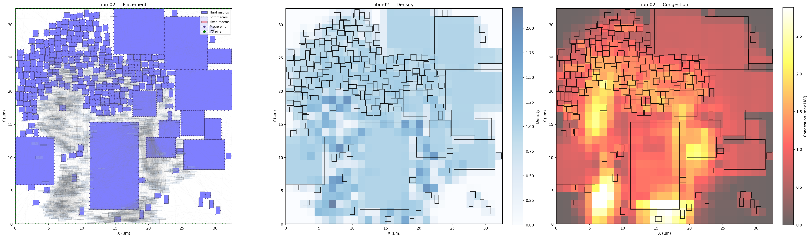
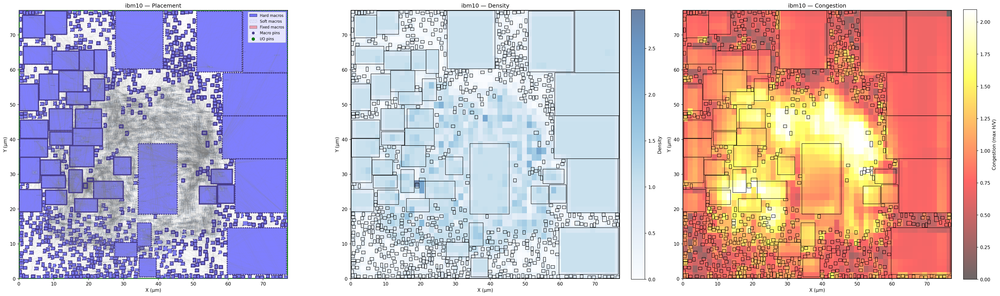
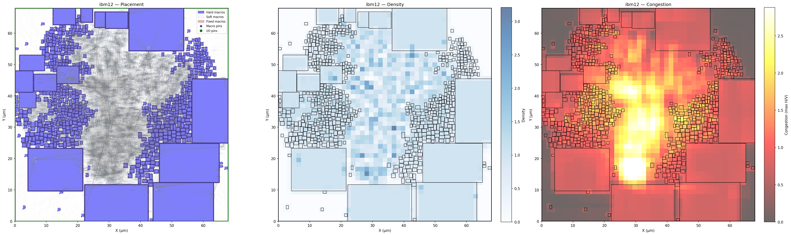

# Macro Placement Challenge 2026 Submission

Macro placement solution developed for the Partcl × Hudson River Trading Macro Placement Challenge 2026. This repository contains my implementation of a legal-first, spectral-guided simulated annealing placement engine for overlap-free macro placement optimization.

# Macro Placement Engine

A macro placement engine built around legal initialization, spectral-guided simulated annealing, and incremental proxy optimization.

The project focuses on practical macro placement under overlap-free constraints while optimizing a proxy composed of:

- Wirelength
- Density
- Congestion

The implementation combines connectivity-aware guidance with fast local optimization and incremental cost evaluation.

---
## Example Placements

The following benchmarks outperformed both the SA and RePlAce baselines while maintaining zero overlaps.

- ibm02: 16.4% better than RePlAce
- ibm10: 11.6% better than RePlAce
- ibm12: 6.3% better than RePlAce

  
  
  

The final implementation beat the SA baseline by 30.2% on average and came within 1.8% of RePlAce while maintaining zero overlaps across all benchmarks.

## Overview

The placement flow is built around a simple idea:

1. Start from a guaranteed legal placement.
2. Use spectral structure as guidance instead of direct placement.
3. Optimize using simulated annealing over legal moves only.
4. Maintain fast incremental proxy updates.
5. Keep the final solution overlap-free at all times.

---

# Placement Pipeline

## 1. Legal Grid Initialization

Earlier experiments showed that directly using spectral embeddings as macro positions creates severe overlap problems that are difficult to legalize reliably.

Instead, the placer begins from a guaranteed legal grid layout:

- macros sorted by area
- evenly spaced grid placement
- shelf-packing fallback if required

This produces a valid overlap-free starting point for optimization.

---

## 2. Spectral-Guided Search

Spectral embeddings are used as target regions during simulated annealing rather than as direct initial coordinates.

This works as a connectivity-aware guidance system:

- highly connected macros are encouraged toward similar regions
- the search remains stochastic
- legality is preserved throughout optimization

The result is a more stable optimization process without expensive legalization failures.

---

## 3. Simulated Annealing

Optimization is performed using multiple simulated annealing phases.

Move types include:

- Gaussian translation moves
- Macro swap moves
- Spectral-targeted moves

The annealer operates only on legal placements using a spatial occupancy grid for fast overlap checks.

A second low-temperature polish phase refines the best intermediate solution.

---

## 4. Incremental Proxy Evaluation

The optimization target combines:

- normalized HPWL
- soft density cost
- congestion cost

To make SA practical at scale, density updates are computed incrementally instead of rebuilding the full grid after every move.

Congestion is evaluated using a routing-style coarse grid approximation.

---

## 5. Legalization and Safety

The placer maintains legality during optimization:

- all proposed moves are checked before acceptance
- spatial hashing enables fast collision detection
- final emergency legalization guarantees overlap-free output

Final solutions contain zero overlaps across all evaluated benchmarks.

---

# Results

## IBM Benchmark Suite

| Benchmark | Proxy | SA Baseline | RePlAce | vs SA | vs RePlAce | Overlaps |
|---|---:|---:|---:|---:|---:|---:|
| ibm01 | 1.0280 | 1.3166 | 0.9976 | +21.9% | -3.0% | 0 |
| ibm02 | 1.5349 | 1.9072 | 1.8370 | +19.5% | +16.4% | 0 |
| ibm03 | 1.3210 | 1.7401 | 1.3222 | +24.1% | +0.1% | 0 |
| ibm04 | 1.3329 | 1.5037 | 1.3024 | +11.4% | -2.3% | 0 |
| ibm06 | 1.8049 | 2.5057 | 1.6187 | +28.0% | -11.5% | 0 |
| ibm07 | 1.4707 | 2.0229 | 1.4633 | +27.3% | -0.5% | 0 |
| ibm08 | 1.7550 | 1.9239 | 1.4285 | +8.8% | -22.9% | 0 |
| ibm09 | 1.0973 | 1.3875 | 1.1194 | +20.9% | +2.0% | 0 |
| ibm10 | 1.3261 | 2.1108 | 1.5009 | +37.2% | +11.6% | 0 |
| ibm11 | 1.3550 | 1.7111 | 1.1774 | +20.8% | -15.1% | 0 |
| ibm12 | 1.6173 | 2.8261 | 1.7261 | +42.8% | +6.3% | 0 |
| ibm13 | 1.3785 | 1.9141 | 1.3355 | +28.0% | -3.2% | 0 |
| ibm14 | 1.5938 | 2.2750 | 1.5436 | +29.9% | -3.3% | 0 |
| ibm15 | 1.5948 | 2.3000 | 1.5159 | +30.7% | -5.2% | 0 |
| ibm16 | 1.4842 | 2.2337 | 1.4780 | +33.6% | -0.4% | 0 |
| ibm17 | 1.7396 | 3.6726 | 1.6446 | +52.6% | -5.8% | 0 |
| ibm18 | 1.7871 | 2.7755 | 1.7722 | +35.6% | -0.8% | 0 |
| **AVG** | **1.4836** | **2.1251** | **1.4578** | **+30.2%** | **-1.8%** | **0** |

Total runtime: **11712.76s**

---

## Modern Macro Benchmarks

| Benchmark | Proxy | WL | Density | Congestion | Overlaps |
|---|---:|---:|---:|---:|---:|
| ariane133 | 0.7137 | 0.054 | 0.600 | 0.718 | 0 |
| ariane136 | 0.7172 | 0.054 | 0.605 | 0.722 | 0 |
| mempool_tile | 0.9733 | 0.063 | 1.082 | 0.740 | 0 |
| nvdla | 0.7559 | 0.053 | 0.659 | 0.747 | 0 |
| **AVG** | **0.7900** | **0.056** | **0.737** | **0.732** | **0** |

Total runtime: **612.15s**

---

# Key Takeaways

- Legal initialization was significantly more stable than direct spectral placement.
- Spectral embeddings worked best as optimization guidance rather than direct coordinates.
- Incremental density updates were critical for practical SA runtime.
- Congestion remained the primary gap relative to analytical placers such as RePlAce.
- The final implementation consistently produced overlap-free placements.

---

# Summary

This project demonstrates that a carefully engineered simulated annealing pipeline can achieve competitive macro placement quality while remaining fully overlap-free.

The final implementation:

- beat the SA baseline by 30.2% on average
- came within 1.8% of RePlAce overall
- produced zero overlaps across all evaluated benchmarks

